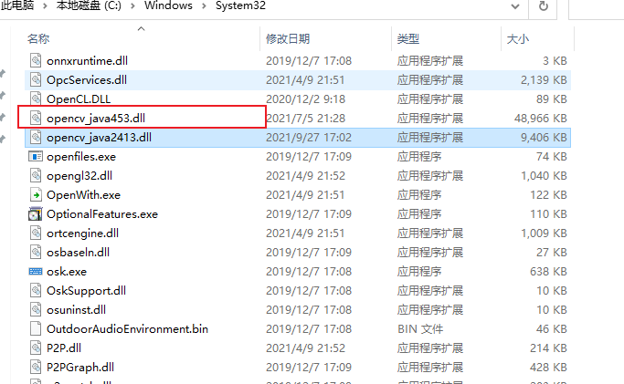

## 安装

[opencv](https://github.com/opencv/opencv/)

下载对应的操作系统，对应的版本, 安装到本地之后，会生成如下文件  


进入当前目录下的 **\build\java** 文件夹, 找到对应的opencv jar包


根据自身系统的版本位数将相对应的dll文件放入相对应的环境变量路径下

例如我的系统为【win10 x64】  
那么我可以将该【opencv_java453.dll】文件放入【C:\Windows\System32】路径下


依赖外部jar包

- 在项目根目录创建libs文件夹
- 将jar包放入libs文件夹
- 执行如下命令，将该jar包打入本地maven仓库

```shell
mvn install:install-file -Dfile=libs/opencv-453.jar -DgroupId=com.opencv -DartifactId=opencv -Dversion=4.5.3 -Dpackaging=jar
```

- groupId和artifactId 可以随便取，但是注意不要和已有maven依赖有冲突
- 在项目pom文件中引入对应的jar包进行使用

```xml

<properties>
    <opencv.version>4.5.3</opencv.version>
</properties>
<dependencies>
<dependency>
    <groupId>com.opencv</groupId>
    <artifactId>opencv</artifactId>
    <version>${opencv.version}</version>
</dependency>
</dependencies>
```

学习教程参考：https://www.likecs.com/show-569674.html